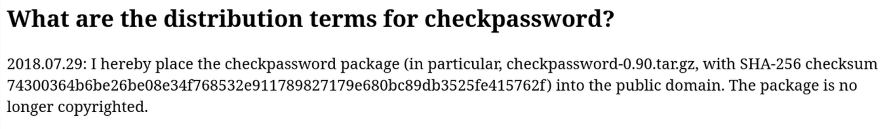

# checkpassword 0.90 — Debian 13 build

[](https://opensource.org/license/0bsd)


`checkpassword` is D. J. Bernstein's minimal password-checking tool. It reads a
login name, password, and timestamp on file descriptor 3, verifies the
credentials against the system password database, and — on success — drops
privileges and executes a supplied program. It is the reference implementation
of the *checkpassword* interface used by qmail-pop3d, dovecot, and others.

This is an **unofficial fork** of the upstream `checkpassword-0.90.tar.gz`
(released 2000-12-22, <http://cr.yp.to/checkpwd.html>) patched to compile and
run on **Debian 13 (trixie)** with **GCC 15 / glibc / libxcrypt**. The original
source no longer builds on a modern toolchain. See [CHANGELOG](CHANGELOG) for
the full list of changes, which fall into two groups:

- **Portability** — the C23 default of GCC 15 (empty `()` prototypes now mean
  "no arguments"), `errno` as a macro, and libxcrypt's missing `libcrypt.so`
  symlink.
- **Security hardening** — a `crypt()` NULL-dereference crash (DoS) reachable
  with locked accounts on modern libxcrypt, login-enumeration timing leaks,
  password-buffer wiping that the compiler could optimize away, a stale-`errno`
  exit-code bug, and integer-overflow guards in the allocator.

## Building

Requires only a C compiler and `make`; no autotools. libxcrypt provides
`crypt()`:

```bash
# libcrypt-dev provides the libcrypt.so link the build prefers.
# Without it, the Makefile falls back to libcrypt.so.1 automatically.
sudo apt install build-essential libcrypt-dev

make
```

Compiler and linker flags live in the DJB-style config files, **not** in the
Makefile:

- [`conf-cc`](conf-cc) — the compile command (includes `-std=gnu17` and the
  `-Wno-*` flags that make the old K&R code build under GCC 15).
- [`conf-ld`](conf-ld) — the link command.
- [`conf-home`](conf-home) — install prefix (default `/`, so `make setup`
  installs `/bin/checkpassword`).

Edit those files, not the Makefile, to change the build.

## Make targets

- `make` / `make it` — **Default.** Build everything: the `checkpassword`
  binary plus the `install` and `instcheck` helpers.
- `make setup` — Build, then run `./install` to copy `checkpassword` into
  `<conf-home>/bin` (default `/bin/checkpassword`, mode 0700, owner root). Needs
  root.
- `make check` — Build, then run `./instcheck` to verify an existing
  installation's paths and permissions.
- `make test` — *(this fork)* Build and run the test suites: `test_unit`
  (library primitives + allocator overflow guards) and `test_checkpassword.sh`
  (binary exit codes).
- `make clean` — *(this fork)* Remove all build products: object files, `*.a`
  archives, generated scripts (`compile`, `load`, …), probe files, and every
  compiled binary. Leaves sources and `conf-*` untouched; `make` rebuilds.

Lower-level targets (`prog`, the individual `*.o`, `unix.a`, `byte.a`, `*.lib`)
exist but are normally driven by the ones above.

## Testing

```bash
make test
```

- [`test_unit.c`](test_unit.c) — assert-based unit tests for `str_*`, `byte_*`,
  `stralloc` growth, and the integer-overflow guards added to the allocator.
- [`test_checkpassword.sh`](test_checkpassword.sh) — exit-code tests for the
  binary: malformed/oversized input, unknown user, and the wrong-password path
  that exercises the `crypt()` NULL-return fix.

## License

The upstream package is in the **public domain**. On **2018-07-29** D. J.
Bernstein dedicated `checkpassword-0.90.tar.gz` (SHA-256
`74300364b6be26be08e34f768532e911789827179e680bc89db3525fe415762f`) to the
public domain, stating *"the package is no longer copyrighted"*
(<https://cr.yp.to/distributors.html>) as seen below. The `Copyright 2000`
notice in [README_ORIGINAL](README_ORIGINAL) predates that dedication and no
longer applies.



Because the base is public-domain, the modifications in this fork can be
released under any terms. This fork uses
**[0BSD](https://opensource.org/license/0bsd)** (BSD Zero-Clause License) —
OSI-approved, no attribution requirement, and it keeps the permissive,
public-domain spirit of the original while being a clear, recognized license for
downstream users. Please read the [LICENSE](LICENSE) file.
